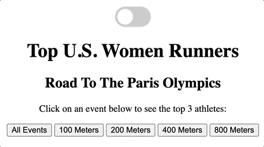
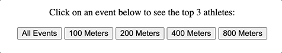
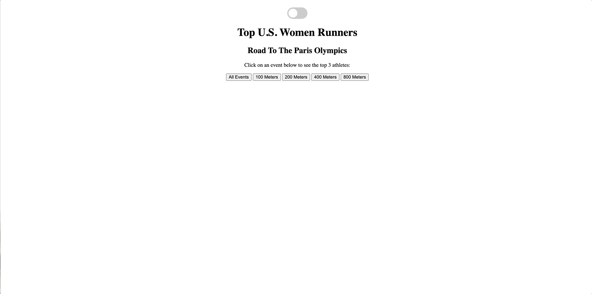
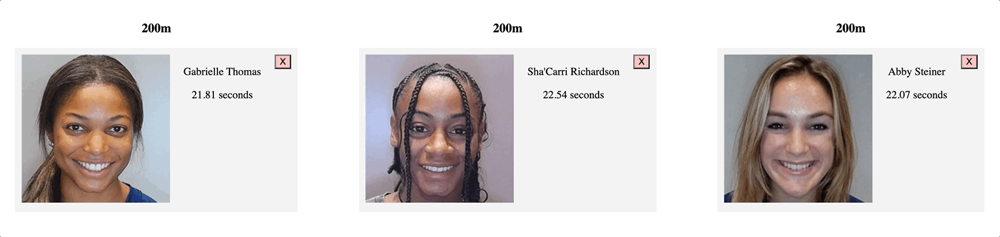

# Phase 1 Project: Top US Women Runners

This project fetches data about the Top US Women Runners in the following events: 100m, 200m, 400m, and 800m.

# Features 
EVENT LISTENERS:

At the top of this page a user can toggle between light and dark mode. This will also change the page's text so it is white (dark mode) or black (light mode).

The race event buttons have mouseover and mouseout event listeners that change the color of the button, and the button's text color, while the mouse is over the card.

When a race event button is clicked, the athletes associated with that event will appear on the screen.

If a user is does not want to see one of the athletes, there is a "close" button on the div with the athlete's information. Clicking this button will remove the athlete's information from the page.

# Credits

100M

Data: World Athletics Ranking Official Site https://worldathletics.org/world-rankings/100m/women?regionType=countries&region=usa&page=1&rankDate=2023-10-03

Athlete Images: 
Sha'Carri Richardson https://media.aws.iaaf.org/athletes/14717691.jpg
Twanisha Terry https://media.aws.iaaf.org/athletes/14553598.jpg
Aleia Hobbs https://media.aws.iaaf.org/athletes/14430847.jpg

200M

Data: World Athletics Ranking https://worldathletics.org/world-rankings/200m/women?regionType=countries&region=usa&page=1&rankDate=2023-10-03

Athlete Images: 
Gabrielle Thomas https://media.aws.iaaf.org/athletes/14733520.jpg
Sha'Carri Richardson https://media.aws.iaaf.org/athletes/14717691.jpg
Abby Steiner https://media.aws.iaaf.org/athletes/14691380.jpg

400M

Data: World Athletics Ranking https://worldathletics.org/world-rankings/400m/women?regionType=countries&region=usa&page=1&rankDate=2023-10-03

Athlete Images: 
Shamier Little https://media.aws.iaaf.org/athletes/14443767.jpg
Lyanna Irby-Jackson https://media.aws.iaaf.org/athletes/14486888.jpg
Sydney McLaughlin-Levrone https://media.aws.iaaf.org/athletes/14624749.jpg

800M

Data: World Athletics Ranking https://worldathletics.org/world-rankings/800m/women?regionType=countries&region=usa&page=1&rankDate=2023-10-03

Athlete Images: 
Athing Mu https://media.aws.iaaf.org/athletes/14708132.jpg
Ajee Wilson https://media.aws.iaaf.org/athletes/14411176.jpg
Nia Akins https://media.aws.iaaf.org/athletes/14615589.jpg

